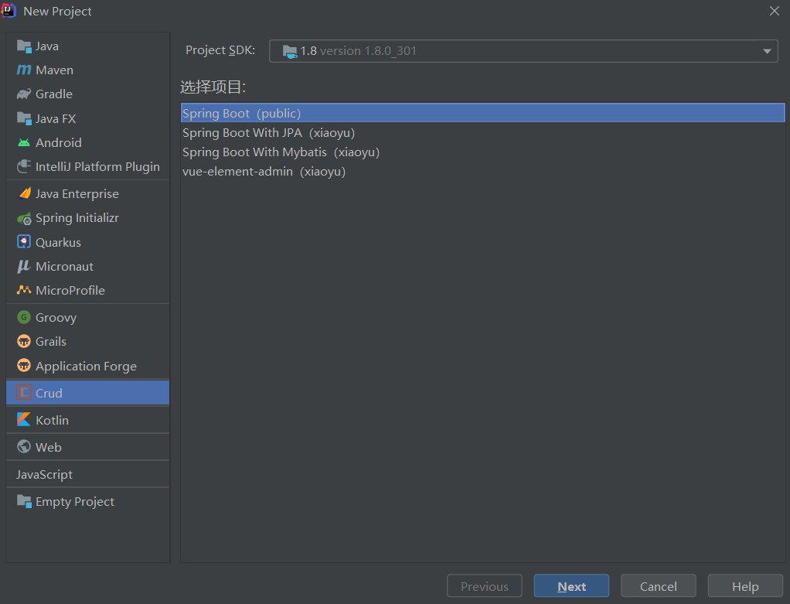

# crud-intellij-plugin

一个用于**代码生成**的插件，可以根据数据库表结构，帮助您从不同的模板快速生成相关代码。crud-intellij-plugin 插件不仅可以在IDEA中使用，在intellij系列产品中皆可使用。

**相关链接:**

- 官网: [Crud Hub](https://crud-hub.top/)

- 在线文档: [Crud Hub Docs](https://crud-hub.top/docs/)

- https://github.com/mars05/crud-hub

**拥有的功能点:**

- 项目生成: 创建一个新的项目

- 代码生成: 在已有项目中，根据表结构生成代码，支持从数据库表、DDL、实体类生成模板代码

- 多数据库: 全局维护数据库连接，目前支持**MySQL、PostgreSQL、Oracle**

- 模板导入: 按需从模板市场导入或使用访问令牌导入自定义模板。模板使用说明请访问: [在线文档](https://crud-hub.top/docs/plugin/idea.html#%E6%A8%A1%E6%9D%BF%E5%AF%BC%E5%85%A5)

## 插件安装
- **插件市场:**  <kbd>File</kbd> > <kbd>Settings</kbd> > <kbd>Plugins</kbd> > <kbd>Marketplace</kbd> > <kbd>Search for "crud"</kbd> > <kbd>Install Plugin</kbd>

- **本地安装**

下载插件文件: [crud-plugin](https://github.com/mars05/crud-intellij-plugin/releases/download/v2.0.1/crud-plugin-2.0.1.zip)

## 模板导入

- **步骤1:** 打开Crud设置界面

<kbd>File</kbd> > <kbd>Settings</kbd> > <kbd>Tools</kbd> > <kbd>Crud</kbd> > <kbd>模板导入</kbd>

- **步骤2:** 市场搜索结果中点导入按钮或点击令牌导入，市场搜索的是开放的模板。对于不开放的模板，可以在 **Crud Hub** > [我的模板](https://crud-hub.top/#/mytemplate/template) 设置访问令牌，然后通过访问令牌导入到插件中

- **步骤3:** 我的模板中可以管理已导入的模板。插件导入后的模板是离线模板，不会随 **Crud Hub** 中的模板修改可自动更新，在插件的**我的模板**中，可以点击刷新模板来和**Crud Hub**中的模板进行同步更新

## 项目生成

打开创建项目的界面:  <kbd>New</kbd> > <kbd>Project</kbd> / <kbd>Module</kbd> > <kbd>Crud</kbd> > <kbd>模板项目选择</kbd>

## 代码生成

选中已有项目，鼠标右键: <kbd>Crud</kbd> > <kbd>代码生成</kbd> > <kbd>模板项目选择</kbd>

## 鸣谢

